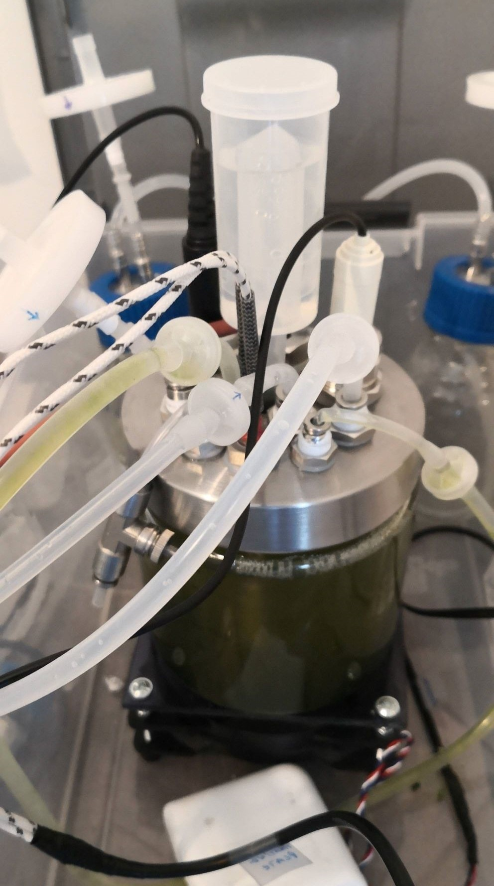
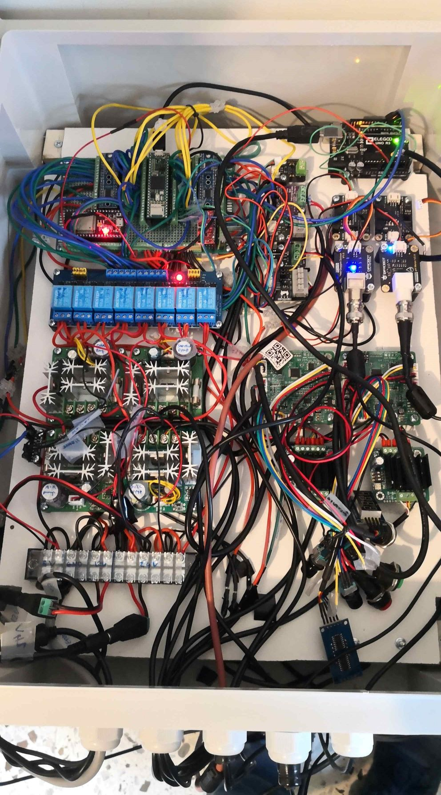

# Bioreactor Control System

<div style="display: flex; justify-content: center; gap: 10px;">
    
    
</div>


## Overview

The Bioreactor Control System is a distributed control system designed for precise management of biological processes. It combines multiple microcontrollers and sensors to provide accurate control of temperature, pH, dissolved oxygen, and nutrient delivery.




- **Server Installation**: For more information on installing the server, go to [this folder](/integration/SERVER/raspberry_pi/ServerFastAPI).
- **Teensy Files**: For more information on the various Teensy files, go to [this folder](/integration/HETEROTROPHIC/XS/teensy).

### Key Features
- Temperature control (15-40°C)
- pH regulation (5.0-8.5)
- Dissolved oxygen management
- Turbidity/Optical Density monitoring
- Automated nutrient delivery
- Real-time monitoring
- Data logging and visualization
- Safety monitoring and alerts

### Main Components

#### Hardware Components
- Main Controller (Teensy 4.1)
- Sensor Transmitter (Arduino Uno)
- Communication Bridge (ESP32S)
- Server (Raspberry Pi 4)
- Various sensors and actuators

#### Software Components
- Multiple control programs (Fermentation, Mix, Drain)
- PID control systems
- Safety monitoring system
- Web interface for control and monitoring
- Data storage and analysis

## System Architecture

The system is structured in layers:

### 1. Control Layer (Teensy 4.1)
- Program execution and state management
- PID control implementations
- Safety system monitoring
- Volume management
- Actuator control

### 2. Sensor Management (Arduino Uno)
- pH and O2 sensor readings
- Sensor calibration
- Data transmission to main controller

### 3. Communication (ESP32S)
- WiFi connectivity
- MQTT protocol implementation
- Real-time data transmission
- Command reception

### 4. Interface (Raspberry Pi)
- Web-based control interface
- Data visualization
- Long-term data storage
- System configuration

For a detailed view of system architecture and component interactions, see [Detailed System Architecture](docs/diagram/bioreactor-system-detailed.svg).

## Sensors and Actuators

### Sensors
1. **Temperature Sensors**
   - Water Temperature (PT100)
   - Air Temperature (DS18B20)
   - Electronic Temperature (DS18B20)
   - Range: 15-40°C

2. **pH Sensor**
   - Range: 0-14 pH
   - Accuracy: ±0.1 pH @25℃
   - Calibration: 2-point (pH 4.0 and 7.0)

3. **Dissolved Oxygen Sensor**
   - Range: 0-20 mg/L
   - Temperature compensated

4. **Air Flow Sensor**
   - Type: YF-S401
   - Range: 1-5 L/min

5. **Turbidity Sensor**
   - Model: SEN0554
   - Non-contact optical measurement
   - UART communication

### Actuators
1. **Pumps**
   - Air Pump (DC)
   - Drain Pump (DC)
   - Sample Pump (DC)
   - Nutrient Pump (Peristaltic)
   - Base Pump (Peristaltic)
   - Fill Pump (DC)

2. **Stirring Motor**
   - Speed Range: 390-1500 RPM
   - PWM control
   - Continuous operation capability

3. **Heating Plate**
   - Power: 100W
   - Temperature Range: up to 100°C
   - PID-controlled

4. **LED Grow Light**
   - Wavelengths: Red (660nm) and Blue (450nm)
   - Intensity control
   - Timer-based operation

## Control Programs

### 1. Fermentation Program
The main program for biological process control, managing multiple parameters simultaneously.

#### Features
- Temperature, pH, and DO₂ control via PID
- Automated nutrient addition
- Volume management
- Safety monitoring
- Data logging
- Emergency protocols

#### Parameters
- Temperature setpoint (15-40°C)
- pH setpoint (5.0-8.5)
- DO₂ setpoint (0-100%)
- Nutrient concentration
- Base concentration
- Duration
- Nutrient delay

### 2. Mix Program
Simple mixing operations with speed control.

#### Features
- Variable speed control
- Timer-based operation
- Safety monitoring
- Pause/Resume capability

### 3. Drain Program
Controlled liquid removal from the bioreactor.

#### Features
- Adjustable flow rate
- Volume monitoring
- Safety checks
- Duration control

### 4. Test Program
System testing and calibration procedures.

#### Features
- Individual actuator testing
- Sensor verification
- PID tuning capabilities
- System diagnostics

## Safety System

### Monitoring Parameters
- Water temperature (15-40°C)
- Air temperature (10-45°C)
- Electronic temperature (<60°C)
- pH (5.0-8.5)
- Dissolved oxygen
- Volume limits
- Turbidity

### Safety Features
1. **Continuous Monitoring**
   - Regular parameter checks
   - Trend analysis
   - Deviation detection

2. **Alert System**
   - Warning alerts
   - Critical alerts
   - Emergency shutdown protocols

3. **Volume Management**
   - Maximum volume monitoring
   - Minimum volume protection
   - Flow rate monitoring

4. **Emergency Procedures**
   - Automatic system shutdown
   - Actuator deactivation
   - Alert notification
   - Data logging

## Communication System

### 1. Serial Communication (UART)
- Between Teensy and Arduino (Sensor data)
- Between Teensy and ESP32 (Commands and data)
- Baud Rate: 9600/115200

### 2. WiFi Communication (ESP32)
- WebSocket for real-time data
- MQTT for command handling
- HTTP for configuration

### 3. Data Protocols
#### Sensor Data Format
```json
{
    "currentProgram": string,
    "programState": int,
    "sensorData": {
        "waterTemp": float,
        "airTemp": float,
        "elecTemp": float,
        "pH": float,
        "oxygen": float,
        "airFlow": float,
        "turbidity": float
    },
    "actuatorData": {
        "airPump": bool,
        "drainPump": bool,
        "samplePump": bool,
        "nutrientPump": bool,
        "basePump": bool,
        "fillPump": bool,
        "stirringMotor": bool,
        "heatingPlate": bool,
        "ledGrowLight": bool
    },
    "actuatorSetpoints": {
        "airPumpValue": int,
        "drainPumpValue": int,
        "samplePumpValue": int,
        "nutrientPumpValue": int,
        "basePumpValue": int,
        "fillPumpValue": int,
        "stirringMotorValue": int,
        "heatingPlateValue": int,
        "ledGrowLightValue": int
    },
    "volumeData": {
        "currentVolume": float,
        "availableVolume": float,
        "addedNaOH": float,
        "addedNutrient": float,
        "addedMicroalgae": float,
        "removedVolume": float
    }
}
```

### Control Commands Format

The system accepts JSON commands in the following format:

For Fermentation Program:
```json
{
    "program": "fermentation",
    "parameters": {
        "temperature": 37.0,
        "pH": 7.0,
        "dissolvedOxygen": 40.0,
        "nutrientConcentration": 10.0,
        "baseConcentration": 1.5,
        "duration": 48, 
        "nutrientDelay": 12.0,
        "experimentName": "Test-01",
        "comment": "Initial test run"
    }
}
```

## Web Interface
### 1. Dashboard

- Real-time sensor readings
- System status
- Active program information
- Alert notifications

### 2. Control Panel

- Program selection and configuration
- Parameter adjustment
- Manual control options
- Emergency stop

### 3. Data Visualization

- Real-time graphs
- Historical data view
- Parameter trending
- Data export capabilities

### 4. Configuration

- PID parameters
- Safety thresholds
- Calibration settings
- System preferences

## Installation and Setup

### Prerequisites
#### Hardware Requirements
- Teensy 4.1 microcontroller
- Arduino Uno
- ESP32S
- Raspberry Pi 4 (2GB+ RAM recommended)
- Power supply (24V DC, 5V DC)
- Network infrastructure

#### Software Requirements
- Arduino IDE 1.8.19+
- Teensyduino
- ESP32 Board Package
- Python 3.8+
- Node.js 14+
- MQTT Broker (Mosquitto)

### Installation Steps

#### 1. Microcontrollers Setup

```bash
# Clone repository
git clone https://github.com/yourusername/bioreactor.git
```

# Install required libraries for Arduino IDE

- PID
- DFRobot_PH
- OneWire
- Adafruit_MAX31865


#### 2. Server Setup  

```bash
# Install required packages
pip install -r requirements.txt

# Configure MQTT broker
sudo apt-get install mosquitto
sudo systemctl enable mosquitto

# Start the server
python server/main.py
```

#### 3. Web Interface

```bash
# Install dependencies
cd web-interface
npm install

# Build and serve
npm run build
npm run serve
```

#### 4. Network Configuration

```bash
# WiFi settings (ESP32)
const char ssid[] = "your_ssid";
const char password[] = "your_password";

# MQTT Configuration
const char* MQTT_HOST = "192.168.1.xxx";
const uint16_t MQTT_PORT = 1883;
```

## Command Line Interface

### Teensy CLI
Connect to Teensy via USB serial connection (115200 baud) to access the command line interface.
Type 'help' to see all available commands for:
- Program control (fermentation, mix, drain, tests)
- Manual actuator control
- PID tuning
- Volume management
- System configuration

### Arduino Uno CLI
Connect to Arduino Uno via USB serial connection (115200 baud).
Type 'help' to access:
- pH sensor calibration commands
- DO₂ sensor calibration commands
- Sensor diagnostics
- Raw sensor data

## Calibration Procedures

### 1. pH Calibration

- Prepare buffer solutions (pH 4.0 and 7.0)
- Enter calibration mode
- Calibrate with pH 7.0 buffer
- Calibrate with pH 4.0 buffer
- Save calibration

### 2. DO₂ Calibration

- Prepare zero solution
- Prepare saturated solutions at different temperatures
- Calibrate zero point
- Calibrate at low temperature
- Calibrate at high temperature

### Communication Protocols

#### UART Configuration
- Baud rates: 9600/115200
- Data bits: 8
- Parity: None
- Stop bits: 1

#### WiFi Requirements
- Protocol: 802.11 b/g/n
- Security: WPA2-PSK
- Port requirements: 1883 (MQTT), 8000 (API), 8080 (Web)

## Development Guide

### Adding New Features

#### 1. Adding a New Sensor
```cpp
class NewSensor : public SensorInterface {
public:
    void begin() override;
    float readValue() override;
    const char* getName() const override;
private:
    // Sensor specific members
};
```

#### 2. Adding a New Actuator
```cpp
class NewActuator : public ActuatorInterface {
public:
    void begin() override;
    void control(bool state, int value) override;
    bool isOn() const override;
    const char* getName() const override;
private:
    // Actuator specific members
};
```

#### 3. Adding a New Program
```cpp
class NewProgram : public ProgramBase {
public:
    void start(const String& command) override;
    void update() override;
    void stop() override;
    void pause() override;
    void resume() override;
private:
    // Program specific members
};
```

## API Documentation

### REST API Endpoints

#### Programs
```http
POST /execute/fermentation
POST /execute/mix
POST /execute/drain
POST /execute/stop
GET  /sensor_data
```

#### Example Requests
Start Fermentation

```json
POST /execute/fermentation
{
    "temperature": 37.0,
    "pH": 7.0,
    "dissolvedOxygen": 40.0,
    "nutrientConcentration": 5.0,
    "baseConcentration": 1.5,
    "duration": 24,
    "nutrientDelay": 2.0,
    "experimentName": "Test-01",
    "comment": "Initial test run"
}
```

#### WebSocket Events
Data Events
```javascript
// Sensor data update
{
    "event": "sensor_update",
    "data": {
        "waterTemp": 37.2,
        "pH": 7.1,
        "oxygen": 39.8
        // ...
    }
}
```

## Diagram

The following diagrams illustrate different aspects of the bioreactor system.  

- **Fermentation Sequence Diagram**: [bioreactor-fermentation-sequence.mermaid](docs/diagram/bioreactor-fermentation-sequence.svg)  

- **State Machine Diagram**: [bioreactor-state-machine.mermaid](docs/diagram/bioreactor-state-machine.svg) 

- **Control System Diagram**: [bioreactor-control-system.mermaid](docs/diagram/bioreactor-control-system.svg)  

- **Data Flow Diagram**: [bioreactor-data-flow.mermaid](docs/diagram/bioreactor-data-flow.svg)  

 
- For a complete technical overview of the system architecture, see the detailed system diagram.
- For additional documentation and diagrams, see the docs/ directory.


