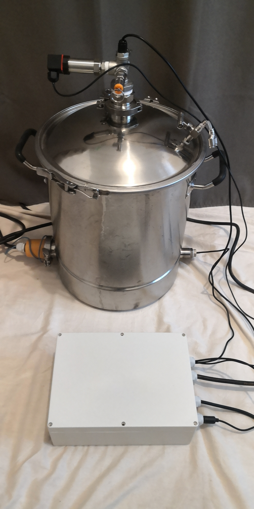
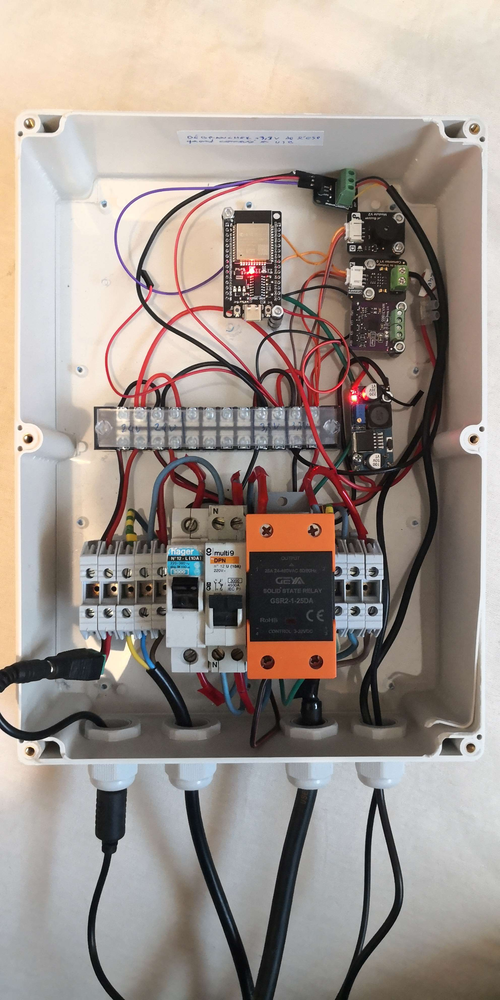
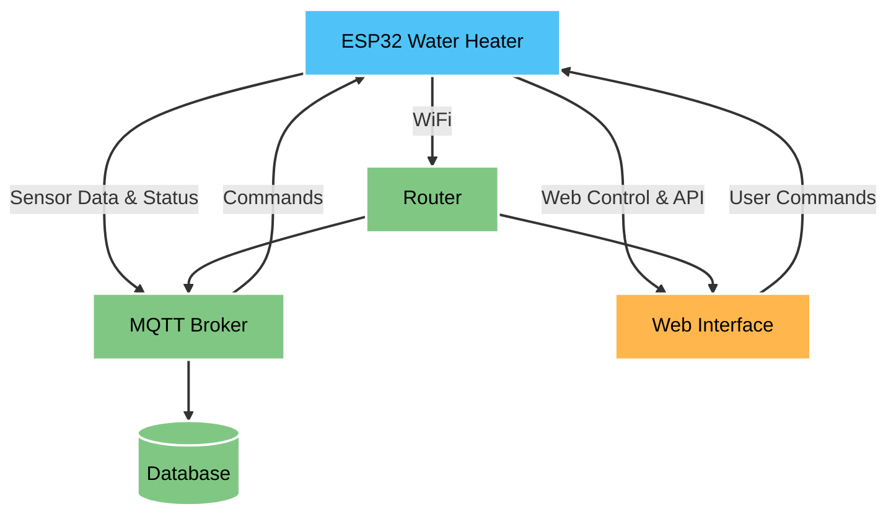

# ESP32 Water Heater Control System

  
  

## 📝 Description
Electric water heater control system based on ESP32, designed for cleaning and sterilization applications. This system provides:

Core Functions:
- Precise water heating control through PID regulation
- Real-time pressure monitoring for safety
- Automated Clean-In-Place (CIP) programs
- Future-ready for sterilization cycles

Control & Monitoring:
- Local web interface for direct control
- MQTT integration for remote monitoring
- REST API for system integration
- Real-time data streaming for process validation

Primary Applications:
- Process water temperature control
- Clean-In-Place (CIP) operations

The system heats water to precise temperatures, maintaining tight control for consistent cleaning and sterilization processes. All parameters are continuously monitored and logged, ensuring process validation and traceability.

## Key Features

### Temperature Control
- PID control with auto-tuning capabilities
- Separate startup and maintenance modes
- Configurable hysteresis
- Precision PT100 temperature sensing

### Safety Systems
- Real-time pressure monitoring
- Temperature limit protection
- Automated emergency shutdown
- Error detection

### Remote Monitoring & Control
- MQTT integration
- Web-based dashboard
- Real-time data visualization
- Secure OTA updates

### Process Programs
- CIP (Clean-In-Place) automation
- Pressure sterilization cycle
- Custom program support

---

## 🛠️ Hardware Requirements

### Core Components
- **ESP32-S3 Development Board**
- **PT100 Temperature Sensor**
- **MAX31865 RTD Amplifier**
- **Industrial Pressure Sensor (4-20mA)**
- **Solid State Relay/MOSFET for heater control**
- **24V DC Power Supply**

### Pin Configuration
#### Temperature Sensor (MAX31865):
- `CS`  -> GPIO22  
- `DI`  -> GPIO23  
- `DO`  -> GPIO24  
- `CLK` -> GPIO25  

#### Pressure Sensor:
- `ADC` -> GPIO18  

#### Heating Control:
- `SSR` -> GPIO5  

---

## 🔧 Software Requirements

### Development Environment
- **Arduino IDE 2.0+**
- **ESP32 Board Package (2.0.5+)**
- **VS Code + Platform IO (optional)**

### Required Libraries
Install via Arduino Library Manager:
- `AsyncMqttClient`
- `ArduinoJson`
- `Adafruit_MAX31865`
- `ESPAsyncWebServer`
- `ElegantOTA`

---

## 📦 Installation

### ESP32 Board Setup
- Open Arduino IDE
- Go to File > Preferences
- Add to Additional Board Manager URLs:
https://dl.espressif.com/dl/package_esp32_index.json
https://raw.githubusercontent.com/espressif/arduino-esp32/gh-pages/package_esp32_index.json
- Go to Tools > Board > Boards Manager
- Install esp32 by Espressif Systems
- Select ESP32 Dev Module

### Library Installation
Install required libraries via the Arduino Library Manager:
- `AsyncMqttClient`
- `ArduinoJson`
- `Adafruit_MAX31865`
- `ESPAsyncWebServer`
- `ElegantOTA`

### Configuration
1. Copy `private_config.h.example` to `config.h` and set WiFi credentials.
2. Set variables in `config.h`.
3. Configure MQTT broker settings.
4. Adjust PID parameters if needed.

---

## 🏗️ Architecture

### Core Components
- **StateMachine:** Main program orchestrator  
- **PIDManager:** Temperature control logic  
- **SafetySystem:** Safety monitoring and emergency handling  
- **MQTTClient:** Remote communication  
- **WebServerManager:** Web interface and OTA updates  

### Task Distribution
- **Core 0:** Network tasks (MQTT, Web Server)  
- **Core 1:** Process control (PID, Sensors)  

---
## 🏗️ Network Architecture

The system integrates multiple network layers for robust control and monitoring:

---

## 📡 Data Management & Server Integration

### Real-time Data Collection
- Continuous sensor data sampling
- JSON-formatted data packets
- Configurable sampling rates
- Automatic data validation

### MQTT Integration
- Broker: Mosquitto MQTT server
- Topics structure for organized data flow
- Real-time data publishing
- Command subscription for remote control

### Database Connectivity
- Compatible with InfluxDB/MongoDB
- Time-series data storage
- Historical data analysis
- Performance metrics tracking

---

## 🌐 Web Interface & API Endpoints

- Program Control : `http://[ESP_IP]/program`
- Data sensors Page : `http://[ESP_IP]/data`
- OTA Updates : `http://[ESP_IP]/update`
- API :
    - System status information : `http://[ESP_IP]/api/status`
    - System metrics and device info : `http://[ESP_IP]/api/system`
    - Data Page : `http://[ESP_IP]/api/data`
    - Start CIP program : `http://[ESP_IP]/cip?temp=XX&duration=YY`
    - Stop all running programs : `http://[ESP_IP]/stop`

---

## 🔒 Security Features
- IP-based OTA access control  
- Basic authentication for web interface  
- MQTT authentication support  
- Update attempt limiting  
- Firmware signature verification  

### 📊 Monitoring & Debugging
- Serial output at 115200 baud
- MQTT status messages
- Web-based real-time monitoring
- System health metrics collection
